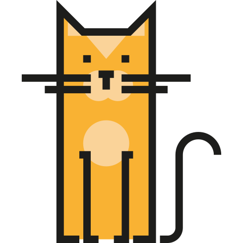
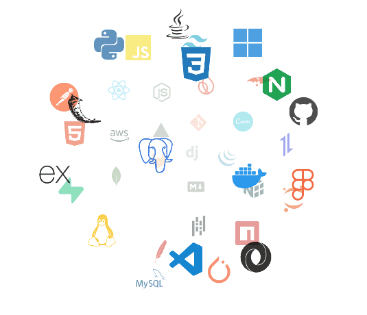

  

<!--Header Name-->
<h1 id="-ɪᴍ-NEHA">I'M Nehaaa </h1>

<em>IT STUDENT (Developer / Programmer)</em>

<!--Start Intro-->               

An IT student and software developer with experience in a diverse set of technologies including Flutter, C, C++, C#, Python, Java, SQL, R, HTML, CSS, JavaScript, TypeScript, PHP, and XML. Well-versed in core concepts such as Data Structures, Discrete Mathematics, and Statistics, with a strong foundation in both programming and problem-solving.

<ul>
  <li>💼 Intern at <strong>Facein Technologies</strong></li>
  <li>🧑‍💻 Former Intern at <strong>NeST Digital Private Limited</strong> (May 2024)</li>
  <li>📚 Academic Projects:
    <ul>
      <li><strong>DriveLens:</strong> A car sales app built with Flutter, featuring data analysis and an AI-based recommendation system</li>
      <li><strong>Resume Website:</strong> Personal website built with HTML, CSS, JavaScript, and PHP, integrated with PHPMyAdmin</li>
      <li><strong>Student Management System:</strong> A Python-based tool to manage academic records (12th Grade project)</li>
    </ul>
  </li>
</ul>

<!--Profile Count Badge-->

  

<picture>
  <source media="(prefers-color-scheme: dark)" srcset="./Skills_Animation_Dark.gif">
  <source media="(prefers-color-scheme: light)" srcset="./Skills_Animation_White.gif">
  
</picture>

<!--Languages and Tools Section-->       
<h2 align="center">Lᴀɴɢᴜᴀɢᴇs ᴀɴᴅ Tᴏᴏʟs</h2> 

  <!--HTML icon -->
  

  <!--Python icon -->
  

  <!--C++ icon -->
  

  <!--Java icon -->
  

  <!--XML icon -->
  

  <!--Flutter icon -->
  

  <!--Phpicon -->
  

  <!--R icon -->
  

<!--Github stats Table--> 

<h2 align="center">Gɪᴛʜᴜʙ Sᴛᴀᴛs 📊</h2>
<table width="100%">
  <tbody>
    <tr>
      <td width="50%">
        <h3 align="center"><strong>Gɪᴛʜᴜʙ Sᴛᴀᴛs</strong></h3>
        

          
        

      </td>
      <td width="50%">
        <h3 align="center"><strong>Sᴛʀᴇᴀᴋ Sᴛᴀᴛs</strong></h3>
        

          
        

      </td>
    </tr>
    <tr>
      <td width="50%">
        <h3 align="center"><strong>Lᴀᴛᴇsᴛ Pʀᴏᴊᴇᴄᴛ</strong></h3>
        

          
        

      </td>
      <td width="50%">
        <h3 align="center"><strong>Tᴏᴘ Cᴏɴᴛʀɪʙᴜᴛɪᴏɴs</strong></h3>
        

          
        

      </td>
    </tr>
  </tbody>
</table>

<!--Contribution Graph-->
<h2 align="center">📈 Cᴏɴᴛʀɪʙᴜᴛɪᴏɴ Gʀᴀᴘʜ 📈</h2>

  

<!--Dynamic Quote card updated everyday at 12 PM--> 
<h2 align="center">🌟 Tʜᴏᴜɢʜᴛ �ᴏғ ᴛʜᴇ Dᴀʏ 🌟</h2>
<!--STARTS_HERE_QUOTE_CARD-->

  

<!--ENDS_HERE_QUOTE_CARD-->

<!--Contact Section--> 
<h2 align="center">🤝 Cᴏɴɴᴇᴄᴛ Wɪᴛʜ Mᴇ 🤝</h2>

  
  
  

<!--Footer--> 

  

  
Credit: <a href="https://github.com/NehaMJ04">NehaMJ04</a>

  
Last Edited on: 29/11/2023

